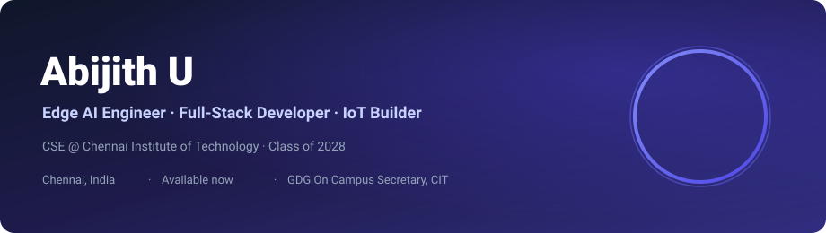
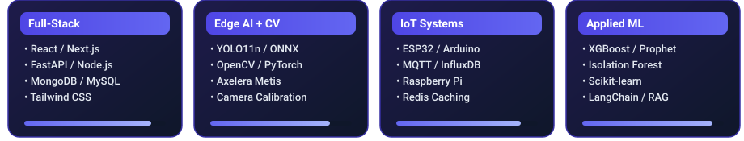

 

  

  
  
  
  
  
  
  
  

 

> I'm a CSE student at Chennai Institute of Technology who doesn't wait to get good — I just build. I'm drawn to hard problems with real stakes, moving fast across the full stack: React frontends, FastAPI backends, ML pipelines, edge AI, IoT hardware, and cloud deployments.
>
> As Secretary of GDG On Campus CIT, I plan and run technical workshops and hackathons. I finished **Top 10 nationally at Guidewire DevTrails 2026** among 5,000+ teams, and I'm rated **Knight — Top 5% of 778,000+** competitors on LeetCode.

<table width="100%">
<tr>
<td width="50%" valign="top">

### Education
**B.E. Computer Science & Engineering**  
Chennai Institute of Technology  
`2024 – Present`  ·  `CGPA 9.10 / 10`

### Languages
`English`  `Tamil`  `Hindi (DBHPS certified)`

</td>
<td width="50%" valign="top">

### Competitive programming
**LeetCode** — 725+ problems solved  
Rating **1880 · Knight** · Top 5% of 778,000+ users

### Focus areas
Edge AI · Full-stack systems · IoT · Applied ML

</td>
</tr>
</table>

<table width="100%">
<tr>
<td width="100%">

### **Edge AI Engineer Intern** &nbsp;·&nbsp; *WG Tech*
`Jun 2026 – Present` &nbsp;·&nbsp; `Chennai, India`

- **Computer Vision Quality Inspection**: Developed an industrial CV quality inspection system using **Python**, **OpenCV**, **YOLO11n**, and **ONNX** deployed on **Axelera Metis** hardware.
- **Calibration & Model Optimization**: Built precise camera calibration pipelines and trained YOLO11n models achieving **90–95% defect detection accuracy**.
- **Real-time Reporting**: Shipped an automated GO/NO-GO inspection dashboard with automated defect reporting.

 

    

</td>
</tr>
<tr>
<td>

### **Product Developer Intern — Freelancer CRM** &nbsp;·&nbsp; *Picabord Technologies Pvt. Ltd.*
`Oct 2025 – Nov 2025` &nbsp;·&nbsp; `Chennai, India`

- **Core CRM Features**: Built end-to-end freelancer management features, shaping product functionality and user workflow.
- **Containerization & API Integration**: Fully **Dockerized** the application for scalable deployment and integrated third-party APIs while eliminating performance bottlenecks.

 

   

</td>
</tr>
<tr>
<td>

### **Full Stack Developer Intern** &nbsp;·&nbsp; *KaizenSpark Tech Pvt. Ltd.*
`Jun 2025 – Aug 2025` &nbsp;·&nbsp; `Chennai, India`

- **Production MERN Solutions**: Enhanced production web codebases using the **MERN stack** to deliver scalable solutions.
- **Agile Collaboration**: Worked within a 4-developer team using **Git** for coordinated feature delivery and bug resolution.

 

    

</td>
</tr>
</table>

| Status | Project | What's happening |
|:---:|---|---|
| Active | **CV Quality Inspection** (WG Tech) | Tuning YOLO11n models and the GO/NO-GO dashboard on Axelera Metis |
| Active | **GigEase** | Refining fraud-detection thresholds post-DevTrails, prepping a public demo |
| In Progress | **SWASTHA** | Extending anomaly detection and alerting for the water quality dashboard |
| In Progress | **ShruthiAI** | Optimizing on-device STT/TTS latency for constrained ARM hardware |

 

<table width="100%">
<tr><td width="20%" align="center"><b>Languages</b></td><td width="80%"></td></tr>
<tr><td align="center"><b>Frontend</b></td><td></td></tr>
<tr><td align="center"><b>Backend & data</b></td><td></td></tr>
<tr><td align="center"><b>IoT & embedded</b></td><td>

</td></tr>
<tr><td align="center"><b>AI / ML / CV</b></td><td>

</td></tr>
<tr><td align="center"><b>Infra & tools</b></td><td></td></tr>
</table>

 

<table width="100%">
<tr>
<td width="25%" valign="top">

**GigEase**
AI's parametric insurance platform

Auto-detects floods and disruptions for gig delivery workers via live APIs, crediting UPI within 10 minutes — zero claim filing. 4-layer fraud detection (Isolation Forest + DBSCAN + GPS-cell fusion) with XGBoost + Prophet for dynamic premium pricing.

`FastAPI` `React` `XGBoost` `Kafka` `Cassandra` `LangChain`

**Top 10 / 5,000+ teams** — Guidewire DevTrails 2026

</td>
<td width="25%" valign="top">

**SWASTHA**
Water quality assessment system

ESP32-based IoT water monitoring with real-time sensing, cloud connectivity, and offline WHO-threshold alerts. React + MQTT + InfluxDB + Redis dashboard; Isolation Forest and Random Forest models hit 96.44% accuracy with automated SMS/FCM alerts.

`ESP32` `MQTT` `InfluxDB` `Redis` `FastAPI` `Scikit-learn`

</td>
<td width="25%" valign="top">

**CARES**
RAG-based document intelligence

Context-aware Q&A over uploaded documents via a custom retrieval-augmented generation pipeline. FastAPI backend handles ingestion and embedding retrieval with full OpenAPI docs; Next.js frontend delivers real-time AI responses.

`Next.js` `FastAPI` `Python` `RAG`

</td>
<td width="25%" valign="top">

**ShruthiAI**
Offline Hindi voice assistant

A fully offline voice assistant running entirely on Raspberry Pi with zero internet dependency, built for privacy and low-resource environments. On-device STT (Vosk), intent handling, and offline TTS (eSpeak NG) tuned for ARM hardware.

`Raspberry Pi` `Python` `Vosk` `eSpeak NG`

</td>
</tr>
</table>

 

  

<table width="100%">
<tr><td width="30%"><b>Guidewire DevTrails 2026</b></td><td>Top 10 finalist among 5,000+ teams nationally, with GigEase</td></tr>
<tr><td><b>LeetCode</b></td><td>725+ problems solved · Rating 1880 · Knight, Top 5% of 778,000+ participants</td></tr>
<tr><td><b>Ideathon ConceptX 1.0 (2026)</b></td><td>Runner-up, Center for Advanced Multidisciplinary Research and Innovation (CAMRI)</td></tr>
<tr><td><b>UPCycle 2K25 (2025)</b></td><td>Top finalist — 24-hr innovation bootcamp, VMRF-DU & StartupTN</td></tr>
<tr><td><b>Hindi Language Proficiency</b></td><td>All levels completed, Dakshin Bharat Hindi Prachar Sabha (DBHPS)</td></tr>
<tr><td><b>GDG On Campus CIT</b></td><td>Secretary — planning & running technical workshops and hackathons</td></tr>
</table>

<b>Certifications</b>

 

- AWS Cloud Practitioner Essentials — AWS Skill Builder
- MongoDB Skill Certifications — MongoDB
- CCNA: Introduction to Networks — Cisco

Let's build something. Reach out through any of these.

  

